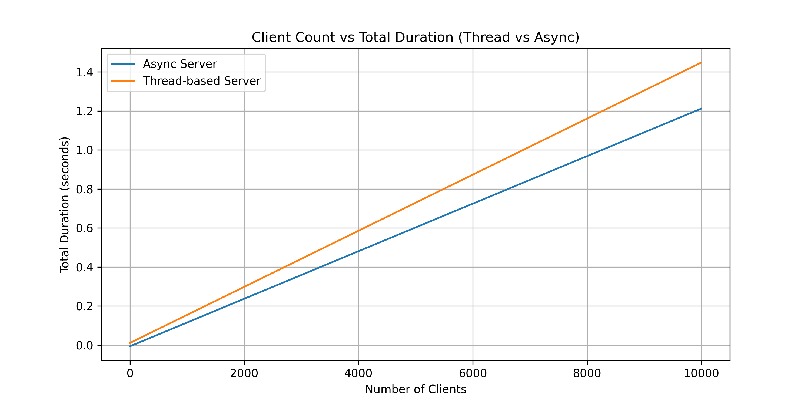

# WebServer实现流程

## 教程相关
首先是按照《Rust语言圣经》中教学的内容用多线程实现了一个Web服务器
HTTP服务器 报文简要格式如下

响应报文也是基于这里的请求报文来编写

```markdown
Request: [
    "GET / HTTP/1.1",
    "Host: 127.0.0.1:8080",
    "Connection: keep-alive",
    "sec-ch-ua: \"Microsoft Edge\";v=\"125\", \"Chromium\";v=\"125\", \"Not.A/Brand\";v=\"24\"",
    "sec-ch-ua-mobile: ?0",
    "sec-ch-ua-platform: \"Windows\"",
    "Upgrade-Insecure-Requests: 1",
    "User-Agent: Mozilla/5.0 (Windows NT 10.0; Win64; x64) AppleWebKit/537.36 (KHTML, like Gecko) Chrome/125.0.0.0 Safari/537.36 Edg/125.0.0.0",
    "Accept: text/html,application/xhtml+xml,application/xml;q=0.9,image/avif,image/webp,image/apng,*/*;q=0.8,application/signed-exchange;v=b3;q=0.7",
    "Sec-Fetch-Site: none",
    "Sec-Fetch-Mode: navigate",
    "Sec-Fetch-User: ?1",
    "Sec-Fetch-Dest: document",
    "Accept-Encoding: gzip, deflate, br, zstd",
    "Accept-Language: zh-CN,zh;q=0.9,en;q=0.8,en-GB;q=0.7,en-US;q=0.6",
    "x-forwarded-for: 1.1.1.1",
]
```

### 线程池

线程池：提升并发处理能力的手段

最多可限制N个线程……

为每一个请求都创建一个线程吗？ 显然是不合理的……

应该是出现一个新的任务 在线程池中找到空闲线程 然后处理


## 基于异步的WebServer实现

到这里我在犹豫是调库还是自己弄一个

`tokio`在Rust是很成熟的异步运行时 

将异步运行时提供给Web服务器……以供调用

主程序的逻辑与原先的基于线程池的实现区别是不大的……

还是监听消息并处理 只是这次是通过异步

**主要的思路是通过本科期间做的课程设计去做一定程度的修改，当然本科期间有很多做的并不完善的点就是了**


### 基本通信
首先将服务器跑起来 然后就是定义消息处理相关的函数 逻辑是一个循环 读取收到的消息 然后输入消息回复
```
loop {
        let mut buffer = vec![0; 1024];
        match socket.read(&mut buffer).await {
            Ok(size) if size == 0 => {
                // 对端关闭连接
                break;
            },
            Ok(size) => {
                let message = String::from_utf8_lossy(&buffer[..size]);
                println!("收到消息: {}", message);

                // 解析消息并处理...
                // 还没做

                // 发送响应
                let mut response = String::new();
                println!("请输入消息（输入 'bye' 结束对话）: ");
                std::io::stdin().read_line(&mut response).unwrap();
                socket.write_all(response.as_bytes()).await.unwrap();
            },
            Err(e) => {
                // 处理错误
                eprintln!("读取失败: {}", e);
                break;
            }
        }
    }
```
客户端和服务器端就差不多的逻辑……也是一样的
目前只能支持一条一条消息(二者之间手动交互)


### 性能测试相关
一条一条消息的话也是可以测试性能的，对于`async_server`和`thread_server`两种实现(一种是调用了tokio运行时的异步实现，另外一种是rust标准的多线程实现)而言，我们可以在客户端创建多个同步线程，然后给运行中的服务器发消息，服务器给客户端响应，最后根据所创建的客户端数量计时，比较二者的时间。
(初步是这样子想的，还没有系统的学习性能测试相关的内容，这部分后续会进一步完善，完善的细节包括测试过程中CPU资源，内存资源的分配情况的统一……避免这些因素给我们的测试带来影响)
客户端创建多个同步线程这点是对于异步实现的服务器和多线程的服务器是一致的……属于是控制一下变量，避免无关的因素有干扰。当然打印操作和保存文件这种I/O对于时间也是有损耗的，不过整个测试过程都在持续，也就无关紧要(整体的时间和客户端的数量还是成正比的，知道这点就行。关键还是在二者之间的比较)
二者都测试完毕之后会读取输出的数据，用python的`matplotlib`库去画图，可视化这个结果。
**注：一定要注意二者的测试条件的等同，两个server的代码要仔细看，尽量避免出现println!()这种影响程序耗时的因素**
以下是初步的测试结果，当然正如前面所说，我们的测试是相对粗糙的。



